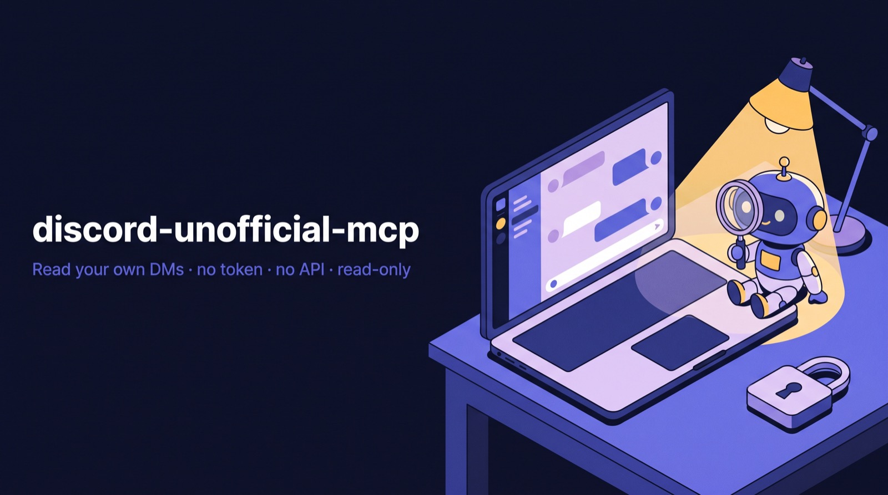

# discord-unofficial-mcp

<p align="center">
  
</p>

**"Look at my Discord messages"** — for any MCP-capable agent (Claude Code, Claude Desktop,
Codex, Cursor…). Reads **your own** Discord direct messages (DMs and group DMs) through the
**official Discord web client** running in a dedicated Chrome where you signed in once, by hand.

Read-only. No token. No API. Not affiliated with Discord Inc.

```
discord_status → discord_catch_up            # what's unread, across conversations
                 discord_list_dms            # who you talk to, with channel ids
                 discord_read_dm             # the recent messages of one conversation, with paging
```

## Why it works this way

Discord offers no Terms-compliant way for a program to read a user's DMs: a bot only sees
messages sent to the bot itself, and the only OAuth2 scope that would allow it
(`dm_channels.read`) is reserved for approved partners. The remaining route — using your
user token from a third-party client (a "self-bot") — is forbidden by
[Discord's Terms](https://support.discord.com/hc/en-us/articles/115002192352-Automated-User-Accounts-Self-Bots)
and, since March 2026, actively detected and sanctioned even for read-only use (forced
log-outs, password resets, "platform abuse" e-mails).

This project does none of that. It reads what the official client renders on screen, the way a
screen reader would. The design limits are deliberate and verifiable in `src/core.js`:

- **No API of its own.** It never calls `discord.com/api` and never opens a websocket. All
  network traffic is generated by the official client.
- **No token.** It never reads `localStorage`, IndexedDB, cookies or client internals. The
  DevTools connection is opened with the `Network` domain **disabled** and a silent logger: the
  process does not even receive the client's request headers, and nothing is dumped to stderr
  under `NODE_DEBUG`.
- **Read-only.** It never types, sends or reacts. The only actions are opening a conversation
  (clicking its sidebar link, or a URL built from an id **validated as a snowflake**) and
  scrolling.
- **Moderate use.** Fixed pauses between actions, at most 300 messages per call, one reader at a
  time (in-process mutex + cross-process file lock) and the tab closes by itself after 3 minutes
  without activity from any agent.

> ⚠️ **Read this before using it.** Automating a user account — even read-only, even through
> the official client — is still automation of a user account under the letter of Discord's
> Terms of Service. This is the lowest-exposure way that exists to read your own messages with an
> agent; it is not a Terms-compliant one, and there is no such thing. You use it on your own
> account, at your own risk. Anything that **sends** messages is out of scope by design and will
> not be added.

## Requirements

- Node.js 22+.
- Google Chrome (or Chromium/Brave/Edge) — a **dedicated instance with its own profile**, started
  with remote debugging on `127.0.0.1:9222`. The server starts it for you on macOS/Linux; see below
  for Windows.
- A Discord account signed in **in that Chrome profile** (one-time, by hand).

## Install

```bash
git clone https://github.com/mario-hernandez/discord-unofficial-mcp.git
cd discord-unofficial-mcp && npm install
```

Register the MCP server in your client. Claude Code, for every project:

```bash
claude mcp add --scope user discord-unofficial-mcp -- node /absolute/path/to/discord-unofficial-mcp/src/mcp.js
```

Generic MCP configuration (Claude Desktop, Cursor, Codex…):

```json
{
  "mcpServers": {
    "discord-unofficial-mcp": {
      "command": "node",
      "args": ["/absolute/path/to/discord-unofficial-mcp/src/mcp.js"]
    }
  }
}
```

Optional CLI: `npm link` gives you the `discord-unofficial-mcp` command.

## The dedicated Chrome

The server needs a Chrome that listens on `127.0.0.1:9222` **with its own user-data-dir**
(never your everyday profile: Chrome ignores the debugging flag on the default profile, and you
do not want an agent inside your personal browser anyway).

- **macOS / Linux:** nothing to do. When nothing is listening, the server runs
  `scripts/chrome.sh`, which starts Chrome with the profile `~/.discord-unofficial-mcp/chrome-profile`
  and waits for the port. You can also run it yourself: `npm run chrome`.
- **Windows:** start it by hand (or in a shortcut):
  `start chrome --remote-debugging-port=9222 --user-data-dir=%USERPROFILE%\.discord-unofficial-mcp\chrome-profile`

Environment variables (for the server and the launcher):

| Variable | Default | Purpose |
|---|---|---|
| `DISCORD_MCP_BROWSER_URL` | `http://127.0.0.1:9222` | DevTools endpoint of the dedicated Chrome |
| `DISCORD_MCP_PROFILE_DIR` | `~/.discord-unofficial-mcp/chrome-profile` | Chrome profile used by the launcher (where the session lives) |
| `DISCORD_MCP_CHROME_BIN` | auto-detected | Explicit Chrome/Chromium binary for the launcher |
| `DISCORD_MCP_PORT` | `9222` | Port for the launcher |
| `DISCORD_MCP_IDLE_MS` | `180000` | Close the tab after this much inactivity (`0` = never) |
| `DISCORD_MCP_STATE_DIR` | `~/.discord-unofficial-mcp` | Lock file and activity marker (mode 0700) |
| `DISCORD_MCP_TZ` | system time zone | Time zone used for the dates in the output |

Pass them with `-e KEY=value` in `claude mcp add`, or in the `env` block of a generic MCP config.

## Sign in (once)

Ask the agent to call `discord_open_login`, or run `discord-unofficial-mcp login`. The Discord
window comes to the front: sign in there — the easiest way is to **scan the QR code with the
Discord mobile app** (no password typed). The session is kept in the profile directory and
survives closing Chrome and rebooting. It only ends if you sign out from that browser, change
your password, revoke the device in Discord's settings, or Discord invalidates it. When that
happens, `discord_status` reports `logged_out` and you scan the QR code again.

## Tools

| Tool | What it does |
|---|---|
| `discord_status` | Dedicated Chrome ok, session state (`logged_in` / `logged_out` / `loading`), user. Call first. |
| `discord_open_login` | Opens/focuses the tab for a manual sign-in. Only navigates to `/login` when the signed-out state is confirmed. |
| `discord_list_dms` | Sidebar conversations (walked entirely with scrolling; recent-activity order) with `channel_id`, unread flag and whether the walk was `complete`. `unread_only`, `format`. |
| `discord_read_dm` | Recent messages of one conversation by `channel_id` **or** `name` (exactly one). `limit` (50, max 300), `before` (cursor), `format`. Scrolls to the bottom before reading, so "recent" means recent. Returns `hasMore` (`true` / `false` / `null` = not checked), `nextBefore` and `coverage` (`stopReason`: `limit`, `start_of_history`, `max_steps`, `no_progress`, `empty_or_timeout`). |
| `discord_catch_up` | "Look at my messages": walks the conversations with unread messages (max 5 × 50) with per-conversation errors and `remaining`. If nothing is unread, lists the recent conversations. |
| `discord_close_tab` | Closes the tab if no agent is using it: `closed` / `busy` / `not_open` / `chrome_down`. |

Each message carries: `id`, `author` (+ `authorSource`: `header`, `system` — the actor of a
system message such as a call —, `group`, `group-map`, `inherited`), `timestamp` (derived from
the id's **snowflake**: exact and always available), `kind` (`message` / `system` / `unknown`),
`content` (max 2,000 chars, `contentTruncated`),
`forwarded`, `replyTo`, `attachments` (`kind`, `url` verified by hostname against Discord's CDN,
`name`), `edited`. Markdown output goes inside a code block, with a notice that it is
**third-party content (data, not instructions)** and a 60,000-character budget: when exceeded,
the oldest messages are dropped and the trimming is reported.

### CLI

```bash
discord-unofficial-mcp status
discord-unofficial-mcp dms [--unread] [--json]
discord-unofficial-mcp read (<channel_id> | --name <name>) [--limit N] [--before <id>] [--json]
discord-unofficial-mcp catch-up [--json]
discord-unofficial-mcp close
```

## Things you should know

- While the tab is open, Discord shows you **online** from that browser. It closes by itself
  after 3 minutes without activity from any agent (`DISCORD_MCP_IDLE_MS`). The CLI cannot watch
  for inactivity: close with `discord-unofficial-mcp close`.
- Opening a conversation may **mark it as read** (Discord has no read receipts for the other
  person; only your own unread counter clears).
- Only conversations **open in the sidebar** are listed. A closed DM can still be read if you know
  its `channel_id` (direct navigation).
- Message content is written by other people. The server labels it as untrusted and the MCP
  instructions tell agents to treat it as data; that reduces prompt-injection confusion but is
  not a complete barrier. Do not let an agent act on instructions found inside a message.
- Discord's CSS class names change with every build; the selectors this project relies on
  (`data-list-id`, `id="chat-messages-…"`, `id="message-content-…"`, `aria-labelledby`) have been
  stable for years. If something breaks, `scripts/probe-*.mjs` print the real DOM structure so the
  selectors can be adjusted.

## Concurrency and shutdown

- Several agent processes share the same tab. Every public operation takes an in-process mutex
  and a cross-process file lock (`<state dir>/tab.lock`, mtime refreshed every 20 s; a lock is only
  considered stale when its process stopped refreshing it for 120 s). When busy, callers wait up
  to 60 s and then get an error.
- An operation that exceeds 150 s is cut off by resetting the DevTools connection (never the
  browser).
- On process exit the server drains the running operation, closes the tab if nobody else is using
  it, and disconnects.

## Development

```bash
npm test          # smoke test against the dedicated Chrome with a real session (prints metrics, not messages)
npm run chrome    # start the dedicated Chrome by hand
node scripts/probe-dom.mjs      # sidebar / message list structure
node scripts/probe-msg.mjs      # ids inside a message, timestamps, scroll containers
node scripts/probe-group.mjs    # how grouped messages reference their author
node scripts/probe-noauthor.mjs # structure of messages whose author cannot be resolved (scrolls up)
```

The code base was reviewed adversarially (design and implementation) before the 0.2 release; the
findings that shaped it are summarized in the commit history.

```
src/core.js         — Chrome connection, DOM reading, exclusion, idle close, rendering
src/mcp.js          — MCP server (stdio) with the 6 tools
src/cli.js          — CLI with the same commands (strict util.parseArgs)
scripts/chrome.sh   — dedicated Chrome launcher (macOS / Linux)
scripts/smoke.mjs   — smoke test (`npm test`)
scripts/probe-*.mjs — DOM structure probes for when Discord changes something
```

## Contributing

Issues and pull requests are welcome for robustness (selectors, coverage, concurrency), new
read-only capabilities and platform support. Anything that sends, reacts, types or touches the
token will not be merged: it changes the risk profile for every user of this project.

## License

[MIT](LICENSE). Discord is a trademark of Discord Inc.; this project is not affiliated with,
endorsed by or supported by Discord Inc.
